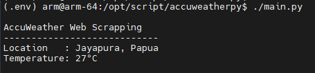

# AccuWeather-python Excercise
## Description
To try this code, isolate python virtual environment with `virtualenv`

Then, install all package requirements with `pip install -r requirements.txt`

And run the script with `./main.py`

## Preview

